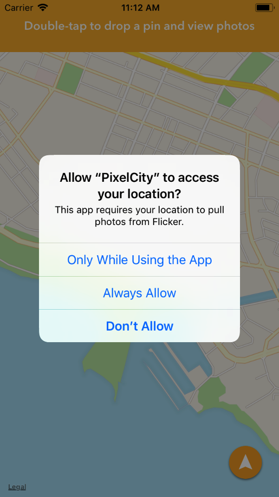
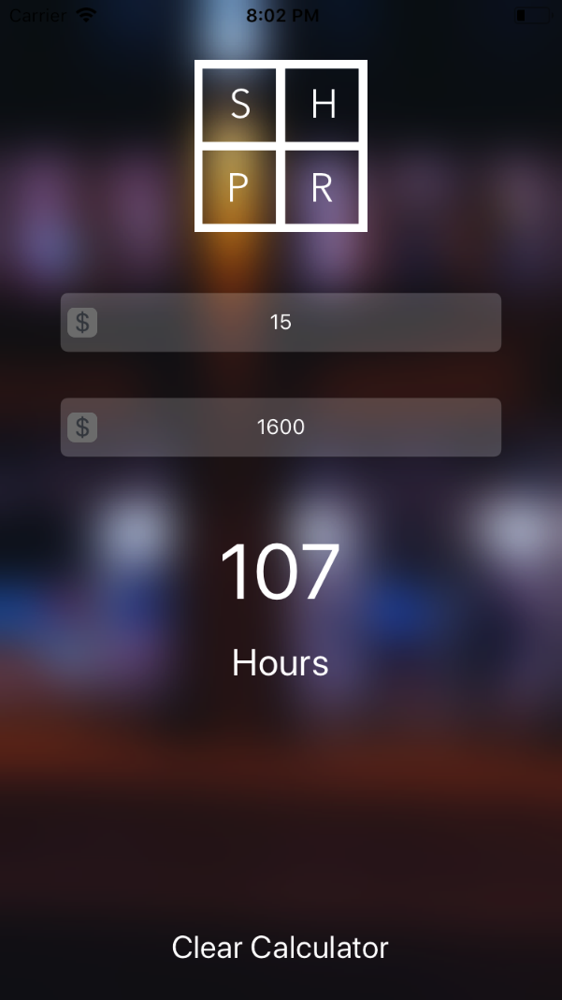

iOS-Development
===============
>This repository holds all of my projects based on iOS mobile applications.

After taking a few computer science courses in college, I knew the fundamentals of writing code but never had a way to visualize or interact with my code. I then stumbled upon Xcode, Swift and an iOS development course on Udemy taught by Mark Price and his team at **Devslopes**. All the projects I have complete from this course can be found below as well as screenshots. 

Once I finished my Udemy course, it was time to further develop my skills. I got together with my buddies [Aman Ketebo](https://github.com/amanketebo) and [Danny Pecoraro](https://github.com/dannyjp) who were also interested in iOS development and formed a group called **SinCityDev**. We met up every weekend with projects in mind to see if we had what it takes to develop them. Those projects can also be found below. 

Table of Contents
=================
<!--ts-->
   * [Algorithm Practice](#algorithm-practice)
   * [Devslope Projects](#devslope-projects)
      * [BreakPoint](#breakpoint)
      * [CoderSwag](#coderswag)
      * [MegaPill](#megapill)
      * [PixelCity](#pixelcity)
      * [Swoosh](#swoosh)
      * [WindowShopper](#windowshopper)
   * [SinCityDev Projects](#sincitydev-projects)
      * [Blackjack](#blackjack)
      * [Firechat](#firechat)
      * [GoalSetter](#goalsetter)
      * [HeadsOrTails](#headsortails)
   * [Contact](#contact)
<!--te-->

Algorithm Practice
==================
In order to become good at programming, a programmer should be able to problem solve and develop algorithms to solve a task. Swift playground is a great candidate for practicing these skills. In the [AlgorithmPractice](AlgorithmPractice) folder, I used Swift playgrounds to solve common whiteboard questions. I also practice HigherOrderFunctions and Swift shorthand to improve my knowledge of Swift in order to become better at creating iOS applications.

Devslope Projects
=================

      This is a collection of all the projects I have completed using Mark Price's <strong><em>iOS 11 & Swift 4: From Beginner to Paid Professional™</em></strong> course on Udemy. 

   

<h2>BreakPoint:</h1>

<h2>CoderSwag</h2>

<h2>MegaPill</h2>

<h2>PixelCity</h2>

 
 
 

<h2>Swoosh</h2>

<h2>WindowShopper</h2>

<h1>SincityDev Projects</h1>
<h2>Blackjack</h2>

<h2>Firechat</h2>

<h2>GoalSetter</h2>

<h2>HeadsOrTails</h2>

Contact
=======
If you would like to learn more about these projects, please contact me at <joshua.ramos.dev@gmail.com>.
